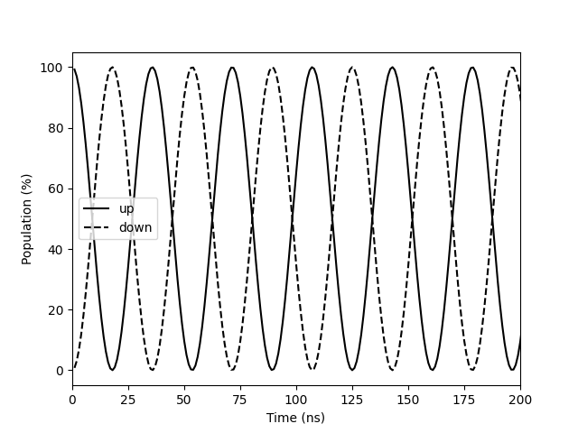
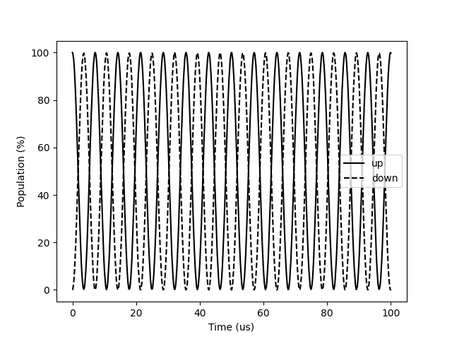
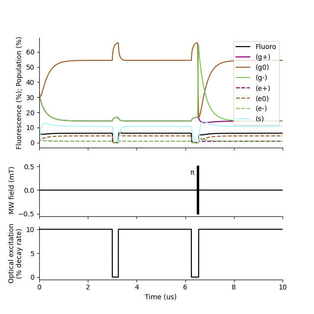
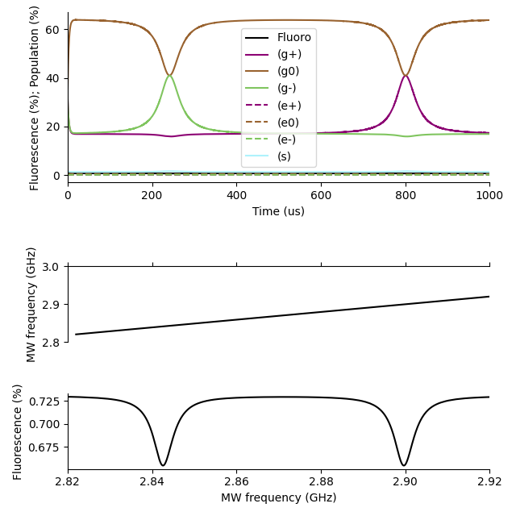

########
Examples
########

.. note::
   
    This is thrown together quickly to help people have some idea of how to
    use the work-in-progress release for the QSSC poster.
    More polish to come in the future.

.. note::

    One needs the superspinsim, numpy, and matplotlib packages to use these
    examples.

Qubit
-----

Basic coupling
~~~~~~~~~~~~~~

Our first example simulates a qubit under coupling between its two states.
The coupling is given in actual physical units: it has the electron g factor of
two, and a magnetic field in the x direction of 1 mT.

.. code:: python

    import numpy as np
    from matplotlib import pyplot as plt

    from superspinsim import simspins

    # Define magnetic field (constant 1 mT along x)
    def mag_x(time):
        return 1e-3

    def mag_y(time):
        return 0.0

    def mag_z(time):
        return 0.0

    # Relevent only for defects
    def excitation(time):
        return 0.0

    # Define qubit (spin-half, electron g factor)
    spins = [[{"S": 1/2, "g": 2.0}]]

    # Define density matrix
    density_initial = np.zeros((2, 2), dtype=np.float64)
    density_initial[0, 0] = 1

    # Simulate
    time, density = simspins(
        [mag_x, mag_y, mag_z, excitation],  # Fields
        0, 100e-6, 1e-9,                    # Time start/stop/step
        spins, [{}], {},                    # Spin description
        density_initial                     # Initial state
    )

    # Plot
    plt.figure(label="Lab frame")
    plt.plot(time/1e-9, density[:, 0, 0].real/1e-2, "k-", label="up")
    plt.plot(time/1e-9, density[:, 1, 1].real/1e-2, "k--", label="down")
    plt.xlim(0, 200)
    plt.xlabel("Time (ns)")
    plt.ylabel("Population (%)")
    plt.legend()

Expected output:

Though this is a basic illustrative example, it is not the recommended way of
simulating a constant bias field in SuperSpinsim.
If we know that the dynamics are dominated by (or entirely) a DC bias term,
then it is more efficient to diagonalise the problem and work within a
"generalised rotating frame".
To use this, define a bias magnetic field in the definition of the spin system.

.. note::

    This is not the same as using the rotating wave approximation.
    The simulator makes no approximations here and actually improves precision.

.. code:: python

    import numpy as np
    from matplotlib import pyplot as plt

    from superspinsim import simspins

    # No "interaction" magnetic field
    def mag_x(time):
        return 0.0

    def mag_y(time):
        return 0.0

    def mag_z(time):
        return 0.0

    # Relevent only for defects
    def excitation(time):
        return 0.0

    # Define qubit 
    spins = [[{
        "S": 1/2, "g": 2.0,           # (spin-half, electron g factor)
        "B0": np.array([1e-3, 0, 0])  # Bias magnetic field of 1 mT along x
    }]]

    # Define density matrix
    density_initial = np.zeros((2, 2), dtype=np.float64)
    density_initial[0, 0] = 1

    # Simulate
    time, density = simspins(
        [mag_x, mag_y, mag_z, excitation],  # Fields
        0, 100e-6, 1e-9,                    # Time start/stop/step
        spins, [{}], {},                    # Spin description
        density_initial                     # Initial state
    )

    # Plot
    plt.figure(label="Rotating frame")
    plt.plot(time/1e-9, density[:, 0, 0].real/1e-2, "k-", label="up")
    plt.plot(time/1e-9, density[:, 1, 1].real/1e-2, "k--", label="down")
    plt.xlim(0, 200)
    plt.xlabel("Time (ns)")
    plt.ylabel("Population (%)")
    plt.legend()

Rabi problem
~~~~~~~~~~~~

We can use time-dependent fields to solve the Rabi problem.

.. code:: python

    import math
    import numpy as np
    from matplotlib import pyplot as plt

    from superspinsim import simspins

    # Define magnetic field (Rabi dressing)
    dressing_frequency = 28e6   # ~ on resonance
    dressing_amplitude = 10e-6  # 10 uT

    def mag_x(time):
        return dressing_amplitude*math.cos(math.tau*dressing_frequency*time)

    def mag_y(time):
        return 0.0

    def mag_z(time):
        return 0.0

    # Relevent only for defects
    def excitation(time):
        return 0.0

    # Define qubit 
    spins = [[{
        "S": 1/2, "g": 2.0,           # (spin-half, electron g factor)
        "B0": np.array([0, 0, 1e-3])  # Bias magnetic field of 1 mT along z
    }]]

    # Define density matrix
    density_initial = np.zeros((2, 2), dtype=np.float64)
    density_initial[0, 0] = 1

    # Simulate
    time, density = simspins(
        [mag_x, mag_y, mag_z, excitation],  # Fields
        0, 100e-6, 1e-9,                    # Time start/stop/step
        spins, [{}], {},                    # Spin description
        density_initial                     # Initial state
    )

    # Plot
    plt.figure(label="Rabi problem")
    plt.plot(time/1e-6, density[:, 0, 0].real/1e-2, "k-", label="up")
    plt.plot(time/1e-6, density[:, 1, 1].real/1e-2, "k--", label="down")
    plt.xlabel("Time (us)")
    plt.ylabel("Population (%)")
    plt.legend()

Expected output:

NV systems
----------

SuperSpinsim contains a model for the nitrogen-vacancy (NV) centre in diamond.
Specifically, this is the seven level model of optical transitions and spin
dynamics.
This is just a predefined spin description (see :doc:`api`) defining
interactions within and between the NV orbitals.

.. note::

    The NV plots use the colour maps from cmcrameri.

Contrast experiment
~~~~~~~~~~~~~~~~~~~

A standard constrast experiment on an NV centre.
We look at the fluorescence response of the NV as it is excited from a thermal
state, a polarised mS = 0 state, and a polarised mS = -1 state.
The difference between the response in the last two can be used to determine
spin projection from fluorescence at the end of future experiments.

Here, fluorescence is modelled as the population of the excited state, since
it is proportional to that.

We also include an illustrative plotting script to show what is happening
during the experiment.

.. code:: python

    import math
    import numpy as np
    from matplotlib import pyplot as plt
    from cmcrameri import cm

    from superspinsim import simspins
    from superspinsim.models import nv_7

    # Define pulse sequence
    duration_excitation = 3e-6
    duration_relax_wait = 250e-9
    duration_mw = 1/(2*10e6)
    frequency_mw = 2.87e9 - 280e6
    amplitude_mw = math.sqrt(1/2)*2*10e6/28e9
    excitation_amplitude = 0.1

    time_thermal_start = 0
    time_thermal_end = time_thermal_start + duration_excitation
    time_zero_start = duration_excitation + duration_relax_wait
    time_zero_end = time_zero_start + duration_excitation
    time_one_start = 2*duration_excitation + 2*duration_relax_wait \
        + duration_mw
    time_one_end = time_one_start + duration_excitation
    time_end = 10e-6

    time_start = 0
    time_step = 1e-9

    bias_field = np.array([0, 0, 1])*10e-3

    def mag_x(time):
        if time < time_one_start - duration_mw:
            return 0
        if time < time_one_start:
            return amplitude_mw*math.sin(math.tau*frequency_mw*time)
        return 0

    def mag_y(time):
        return 0

    def mag_z(time):
        return 0

    def excitation(time):
        if time < time_thermal_end:
            return excitation_amplitude
        if time < time_zero_start:
            return 0
        if time < time_zero_end:
            return excitation_amplitude
        if time < time_one_start:
            return 0
        return excitation_amplitude

    # Initial state (thermal in ground orbital state)
    density_initial = np.zeros((7, 7), dtype=np.float64)
    density_initial[0, 0] = 1/3
    density_initial[1, 1] = 1/3
    density_initial[2, 2] = 1/3

    # Define model
    model = nv_7(bias_field)

    # Simulate
    time, density = simspins(
        [mag_x, mag_y, mag_z, excitation],
        time_start, time_end, time_step,
        *model,
        density_initial
    )

    # Get fluorescence
    fluorescence = density[:, 3, 3] + density[:, 4, 4] + density[:, 5, 5]
    fluorescence = fluorescence.real

    # Plot
    time_coefficients_sample = np.arange(time_start, time_end, time_step/10)
    coefficient_sample_x = np.empty_like(time_coefficients_sample)
    coefficient_sample_l = np.empty_like(time_coefficients_sample)
    for time_index, time_sample in enumerate(time_coefficients_sample):
        coefficient_sample_x[time_index] = mag_x(time_sample)
        coefficient_sample_l[time_index] = excitation(time_sample)

    plt.figure(
        label="fluorescence",
        figsize=(6.4, 6.4)
    )
    plt.subplot(2, 1, 1)
    plt.plot(time/1e-6, fluorescence/0.01, "k-", label="Fluoro")
    plt.plot(
        time/1e-6, np.real(density[:, 0, 0])/0.01, "-", color=cm.hawaii(0/3),
        label="(g+)"
    )
    plt.plot(
        time/1e-6, np.real(density[:, 1, 1])/0.01, "-", color=cm.hawaii(1/3),
        label="(g0)"
    )
    plt.plot(
        time/1e-6, np.real(density[:, 2, 2])/0.01, "-", color=cm.hawaii(2/3),
        label="(g-)"
    )
    plt.plot(
        time/1e-6, np.real(density[:, 3, 3])/0.01, "--", color=cm.hawaii(0/3),
        label="(e+)"
    )
    plt.plot(
        time/1e-6, np.real(density[:, 4, 4])/0.01, "--", color=cm.hawaii(1/3),
        label="(e0)"
    )
    plt.plot(
        time/1e-6, np.real(density[:, 5, 5])/0.01, "--", color=cm.hawaii(2/3),
        label="(e-)"
    )
    plt.plot(
        time/1e-6, np.real(density[:, 6, 6])/0.01, "-", color=cm.hawaii(0.99),
        label="(s)"
    )
    plt.xlim(0, time_end/1e-6)
    plt.ylabel("Fluorescence (%); Population (%)")
    plt.legend()
    plt.gca().set_xticklabels([])
    plt.gca().spines[["top", "right"]].set_visible(False)

    plt.subplot(4, 1, 3)
    plt.plot(time_coefficients_sample/1e-6, coefficient_sample_x/1e-3, "k-")
    plt.text(6.2, 0.3, "π", va="bottom")
    plt.xlim(0, time_end/1e-6)
    plt.ylabel("MW field (mT)")
    plt.gca().set_xticklabels([])
    plt.gca().spines[["top", "right"]].set_visible(False)

    plt.subplot(4, 1, 4)
    plt.plot(time_coefficients_sample/1e-6, coefficient_sample_l/1e-2, "k-")
    plt.xlim(0, time_end/1e-6)
    plt.xlabel("Time (us)")
    plt.ylabel("Optical excitation\n(% decay rate)")
    plt.gca().spines[["top", "right"]].set_visible(False)

Expected output:

ODMR
~~~~

This ODMR sweep has a fully-rendered microwave tone.

.. code:: python

    # Define pulse sequence
    time_start = 1e-6
    time_end = 1000e-6
    time_step = 150e-9
    frequency_start = 2.82e9
    frequency_width = 100e6

    bias_field = np.array([0, 0, 1])*1e-3

    def mag_x(time):
        if time > time_start:
            phase = math.tau*(
                frequency_start*(time - time_start)
                + frequency_width*((time - time_start)**2)
                / (time_end - time_start)/2
            )
            return 100e-6*math.sin(phase)
        else:
            return 0

    def mag_y(time):
        return 0

    def mag_z(time):
        return 0

    def excitation(time):
        return 0.01

    # Initial state (thermal in ground orbital state)
    density_initial = np.zeros((7, 7), dtype=np.float64)
    density_initial[0, 0] = 1/3
    density_initial[1, 1] = 1/3
    density_initial[2, 2] = 1/3

    # Define model
    model = nv_7(bias_field)

    # Simulate
    time, density = simspins(
        [mag_x, mag_y, mag_z, excitation],
        0, time_end, time_step,
        *model,
        density_initial,
        # Integrate on a finer time step than is output
        number_of_fine_divisions=300
    )

    # Get fluorescence
    fluorescence = density[:, 3, 3] + density[:, 4, 4] + density[:, 5, 5]
    fluorescence = fluorescence.real

    # Plot
    plt.figure(
        label="fluorescence",
        figsize=(6.4, 6.4)
    )
    plt.subplot(2, 1, 1)
    plt.plot(time/1e-6, fluorescence/0.01, "k-", label="Fluoro")
    plt.plot(
        time/1e-6, np.real(density[:, 0, 0])/0.01, "-", color=cm.hawaii(0/3),
        label="(g+)"
    )
    plt.plot(
        time/1e-6, np.real(density[:, 1, 1])/0.01, "-", color=cm.hawaii(1/3),
        label="(g0)"
    )
    plt.plot(
        time/1e-6, np.real(density[:, 2, 2])/0.01, "-", color=cm.hawaii(2/3),
        label="(g-)"
    )
    plt.plot(
        time/1e-6, np.real(density[:, 3, 3])/0.01, "--", color=cm.hawaii(0/3),
        label="(e+)"
    )
    plt.plot(
        time/1e-6, np.real(density[:, 4, 4])/0.01, "--", color=cm.hawaii(1/3),
        label="(e0)"
    )
    plt.plot(
        time/1e-6, np.real(density[:, 5, 5])/0.01, "--", color=cm.hawaii(2/3),
        label="(e-)"
    )
    plt.plot(
        time/1e-6, np.real(density[:, 6, 6])/0.01, "-", color=cm.hawaii(0.99),
        label="(s)"
    )
    plt.xlim(0, time_end/1e-6)
    plt.xlabel("Time (us)")
    plt.ylabel("Fluorescence (%); Population (%)")
    plt.legend()
    plt.gca().spines[["top", "right"]].set_visible(False)

    time_start = 1e-6
    frequency_start = 2.82e9
    frequency_width = 100e6
    mw_frequency = frequency_start \
        + frequency_width*(time - 20*time_start)/(time_end - 20*time_start)
    mw_frequency = mw_frequency[time > 20*time_start]
    clipped_odmr = fluorescence[time > 20*time_start]

    plt.subplot(4, 1, 3)
    plt.plot(time[time > 20*time_start]/1e-6, mw_frequency/1e9, "k-")
    plt.gca().set_xticklabels([])
    plt.xlim(0, time_end/1e-6)
    plt.ylim(2.8, 3)
    plt.ylabel("MW frequency (GHz)")
    plt.gca().spines[["bottom", "right"]].set_visible(False)
    plt.gca().xaxis.tick_top()

    plt.subplot(4, 1, 4)
    plt.plot(mw_frequency/1e9, clipped_odmr/1e-2, "k-")
    plt.xlim(frequency_start/1e9, (frequency_start + frequency_width)/1e9)
    plt.xlabel("MW frequency (GHz)")
    plt.ylabel("Fluorescence (%)")
    plt.gca().spines[["top", "right"]].set_visible(False)

    plt.tight_layout()

Expected output:

