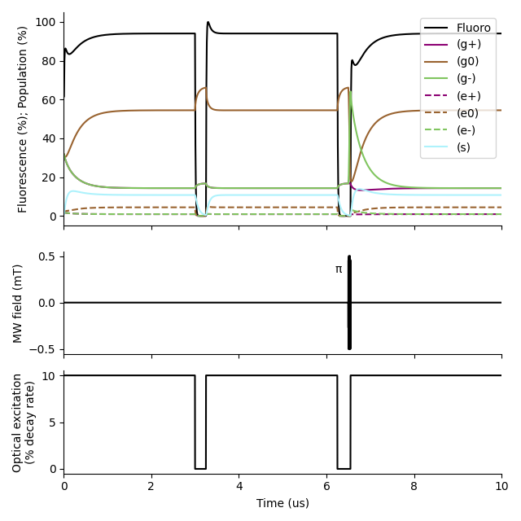
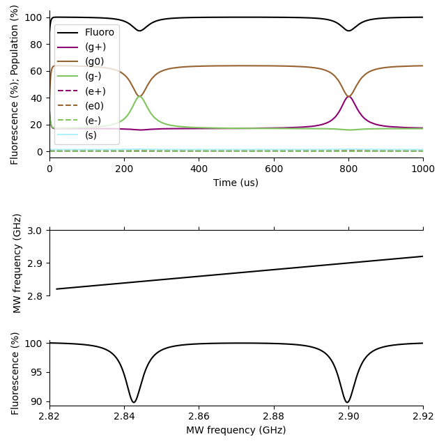

##########################
SuperSpinsim Documentation
##########################

SuperSpinsim is a python package that simulates the time-dependent Lindblad
equation on a GPU.
It is designed to work without needing to use the rotating wave approximation
(RWA).

Contrast simulation:

ODMR simulation:

Documentation contents
======================

.. toctree::
   
    installation
    api

